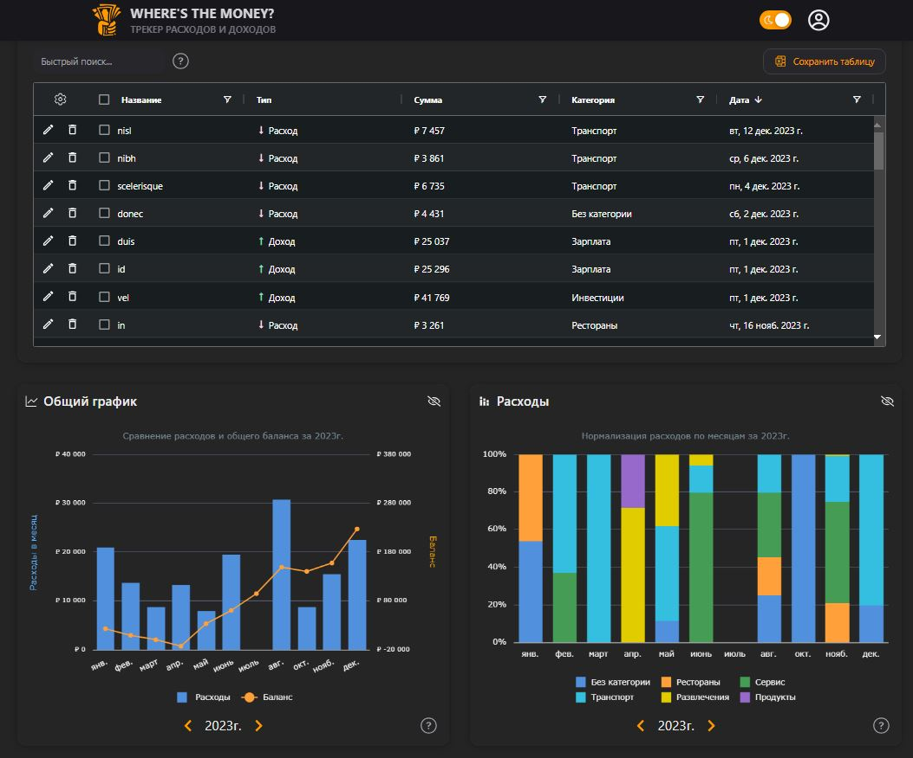

# Where's the money?

### **Описание**

Приложение для отслеживания домашних расходов и доходов. Позволяет вести учет и собирать статистику по времени и категориям.

#### 🔗 [Live preview](https://wherethemoney.vercel.app/)



### **Особенности**

- JWT авторизация
- Добавление/редактирование транзакций
- Создание категорий расходов/доходов и управление представлением
- Наглядная статистика с графиками расходов, разбитая по годам, месяцам и категориям
- Таблица учета транзакций с фильтрами и сортировкой
- Настраиваемое отображение карточек на главной страницы
- Экспорт таблицы транзакций в формат xlsx
- Переключение темы оформления (темная/светлая)

### **Стек**

- **Frontend**
  - React
  - Redux Toolkit
  - React Router
  - React Hook Form
  - AG Grid
  - AG Charts
  - TypeScript
  - Tailwind
  - Next UI
  - Vite
- **Backend**
  - Express
  - Prisma (MongoDB)
  - JWT
  - Bcrypt
  - Docker

### Установка и запуск

1. Клонировать репозиторий

```bash
git clone https://github.com/Dimar1510/money-tracker.git
```

2. Переименовать клиентский .env.local file to .env

```bash
mv money-tracker/client/.env.local money-tracker/client/.env
```

3. Перейти в папку сервера

```bash
cd money-tracker/server
```

4. Переименовать серверный .env.local file to .env (если нужно поменять database URL или compose project name)

```bash
mv .env.local .env
```

5. Запустить сборку

```bash
docker compose up
```

6. Сайт будет доступен по _http://localhost:80_
